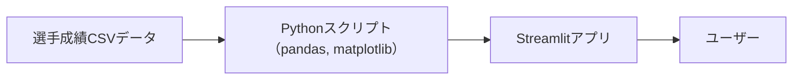

# ⚾ dodgers-war-analysis

本プロジェクトは、2025年MLBナ・リーグ西地区（NL West）における主力スタメン選手の打撃成績（OPS・WAR・AVG・HR）を可視化・分析・比較する**Streamlit製のデータ可視化アプリ**です。  
過去3年分（2022〜2024年）のデータを用いて、**チーム力・補強状況・打線の厚み**を多角的に分析できます。

- Dodgers（ドジャース）
- Padres（パドレス）
- Giants（ジャイアンツ）
- DBacks（ダイヤモンドバックス）
- Rockies（ロッキーズ）
---

## 背景と目的

近年、WAR（勝利貢献度）やOPSなどの高度な打撃指標を用いた選手分析が広まりつつありますが、
チーム全体の「打線」としてのパフォーマンスを比較する視点は、意外と一般には知られていません。
特にファンの間では、「補強選手は本当に貢献しているのか？」「チームの弱点はどこか？」といった
直感的な疑問を持ちつつも、データで答える手段が少ない状況です。

本アプリは、2025年のMLBナ・リーグ西地区の打線を可視化し、WAR/OPS等を用いて
「どの打順に強み・弱みがあるのか」を視覚的に理解することを目的としています。

**単なる感覚ではなく、データを元に「強さ」を語れるツールを作る**ことで、ファンや分析者がより深くMLBを楽しめる環境を目指しています。

---

## ファイル構成

| ファイル名                  | 説明                                                              |
|----------------------------|-------------------------------------------------------------------|
| `streamlit.py`             | Streamlit アプリ本体。CSVを読み込み、指標別に可視化           |
| `generate_3yr_stats.py`    | pybaseballからデータを取得してCSV化するスクリプト（2022〜2024年）|
| `nl_west_2022_2024_stats.csv` | 選手成績データ（OPS, WAR, AVG, HR, 新加入フラグ含む）           |
| `requirements.txt`         | 必要ライブラリのリスト（デプロイ用）                            |

---

## 機能一覧

スタメン45人の成績表示（OPS / WAR / AVG / HR）
棒グラフ：指標順で並べ、チーム別に色分け
ヒートマップ：選手 × 指標の成績を濃淡で可視化
チーム平均線の表示
タブ切替UI：棒グラフ・ヒートマップをスムーズに切り替え
補強選手の抽出機能
※2025年シーズン開始時点で新たにNL西地区に加わった選手に New=True フラグを設定。移籍タイミングではなく実質的な所属変更をベースに定義しています。

---
## 使用技術と選定理由

| 技術      | 理由                                                                 |
|-----------|----------------------------------------------------------------------|
| Python    | データ整形・可視化に最適。pandasやmatplotlibを多用                |
| Streamlit | インタラクティブなWebアプリを素早く構築可能                         |
| GitHub    | バージョン管理とドキュメント発信用                                   |
| pandas     | データフレーム処理       | WARやOPSのような指標を扱う集計処理に最適                               |
| matplotlib | グラフ可視化             | カスタマイズ性が高く、Streamlitとの相性も良いため                      |

---

## 使い方

### 1. ライブラリのインストール
```bash
pip install streamlit pandas matplotlib seaborn
```

### 2. アプリを起動
```bash
streamlit run streamlit.py
```

---

## 補足

- データはFangraphs・Baseball Savant等を参照し、手動でCSV整備しました
- `generate_3yr_stats.py` を用いると、pybaseballから自動で3年分の成績取得が可能です
- アプリは [Streamlit Cloud]([https://dodgers-war-analysis-X.streamlit.app](https://dodgers-war-analysis-n2ayxkwwwkftewh7crwyv4.streamlit.app/)) で公開中です

---

## Streamlitで作ったアプリUI
選手別に指標を比較したり、補強選手だけを抽出することも可能です。
平均線・チーム別色分け・ヒートマップなども対応済み。

### 棒グラフ画面


### ヒートマップ画面


アプリはこちらから試せます！
https://dodgers-war-analysis-n2ayxkwwwkftewh7crwyv4.streamlit.app/

---

## こだわりポイント・工夫した点

- **WAR/OPS比較の視覚化**：スタメン9人のポジション別に横並び比較することで、打線の厚みを一目で把握可能に。
- **ユーザー操作性**：Streamlitのセレクトボックスで他球団（例：パドレス・ジャイアンツ）との比較がワンタッチ。
- **補強選手の影響分析**：過去WARデータと組み合わせて、補強による戦力上昇を定量的に確認できる。
- **将来拡張を見据えた設計**：データの差し替えにより、他リーグや年度への拡張が容易。
---

## 主な機能

- Dodgersを含むNL西地区全チームのスタメン比較（1〜9番）
- 指標ごとの打順別ヒートマップ（OPS/WAR）
- チーム単位・打順単位での成績平均の比較
- インタラクティブなチーム・指標切り替え機能

## インフラ構成（ローカル環境想定）



## データ構成例

| name       | team    | pos | order | war  | ops  |
|------------|---------|-----|-------|------|------|
| Ohtani     | LAD     | DH  | 2     | 3.1  | 0.945|
| Freeman    | LAD     | 1B  | 3     | 2.9  | 0.910|


## スキル活用ポイント

本プロジェクトでは以下のスキルを総合的に活用しています：

- Python（pandas, matplotlib, seaborn, Streamlit）による**データ加工・可視化**
- pybaseball等のAPI利用による**データ収集・自動化**
- LightGBMを用いた**HR予測モデルの構築と検証**
- フロント〜バックまで**一人で完結できる分析パイプラインの設計力**

---
## 学び・つまずき

- **WARやOPSの指標構造の理解**：単なる数値ではなく、その算出元（打席数、出塁率、長打率など）を深掘り
- **Streamlitのコンポーネント設計**：状態管理（SessionState）にやや苦戦したが、UI制御の練習に
- **チーム間で選手ポジションがずれる問題**：ユーティリティ選手のWAR集計に調整が必要だった
---
## 今後の展望

- Fangraphsなど外部APIを活用した**リアルタイムデータ更新**
- Pitching面や守備指標も加えた**トータルチーム分析**
- **MLB全体の打線ランキングアプリ**へのスケーラブル展開


> qiita: [https://qiita.com/flopsy_tech/items/76eeaff297c819e66e28]

